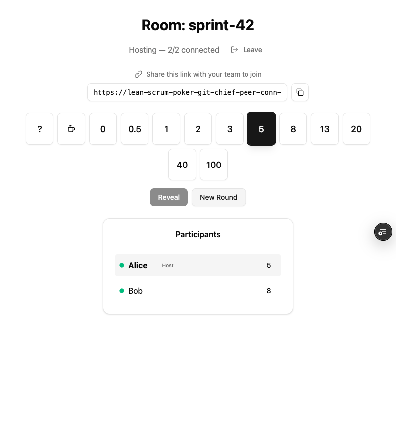

# Simple Free Scrum Poker

A free, real-time planning poker app for agile teams. No sign-up required — just create a room, share the link, and start estimating.



## Features

- **Real-time sync** — Votes, reveals, and participant names update instantly across all connected browsers via WebRTC peer-to-peer data channels and Yjs CRDTs
- **No server state** — All session data lives in the browsers. The server only handles initial WebRTC signaling
- **Connectivity indicators** — Green/amber/gray dots show each participant's connection status in real time
- **Editable names** — Click your name in the participants list to change it. The update propagates to everyone instantly
- **Auto-reconnect** — If the host refreshes or a connection drops, participants automatically detect and reconnect
- **Room capacity** — Up to 12 participants per room
- **Card flip animation** — Votes are hidden until the host reveals, with a card-flip transition

## Tech Stack

- [Bun](https://bun.sh) — Runtime, bundler, and dev server
- [React 19](https://react.dev) — UI
- [Tailwind CSS 4](https://tailwindcss.com) — Styling
- [shadcn/ui](https://ui.shadcn.com) — Component library (Dialog, Button, Card, Input, etc.)
- [Yjs](https://yjs.dev) — CRDT-based shared state (participants, votes, room metadata)
- [WebRTC](https://webrtc.org) — Peer-to-peer data channels in a star topology (host relays to joiners)
- [Vercel](https://vercel.com) — Serverless deployment (signaling API as edge functions)

## Getting Started

```bash
bun install
bun dev
```

Open [http://localhost:3000](http://localhost:3000), enter your name and a room name, then share the URL with your team.

## How It Works

1. The first person to join a room becomes the **host**
2. The host's browser creates WebRTC offers and relays all Yjs updates between participants (star topology)
3. Joiners connect peer-to-peer to the host via a lightweight signaling API
4. All shared state (participants, votes, reveal status) is managed by Yjs CRDTs, ensuring consistency even with network hiccups
5. When everyone has voted, the host clicks **Reveal** to flip all cards simultaneously

## License

MIT
